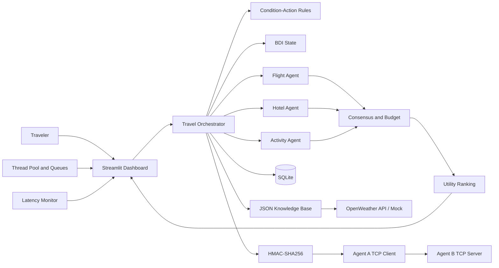

# SmartTrip AI Architecture

```mermaid
flowchart LR
    U[Traveler] --> S[Streamlit Dashboard]
    S --> O[Travel Orchestrator]
    O --> R[Condition-Action Rules]
    O --> B[BDI State]
    O --> F[Flight Agent]
    O --> H[Hotel Agent]
    O --> A[Activity Agent]
    F --> K[Consensus and Budget]
    H --> K
    A --> K
    K --> UO[Utility Ranking]
    UO --> S
    O --> DB[(SQLite)]
    O --> KB[JSON Knowledge Base]
    KB --> W[OpenWeather API / Mock]
    O --> SEC[HMAC-SHA256]
    SEC --> TCP[Agent A TCP Client]
    TCP --> SRV[Agent B TCP Server]
    WKR[Thread Pool and Queues] --> S
    MON[Latency Monitor] --> S
```
